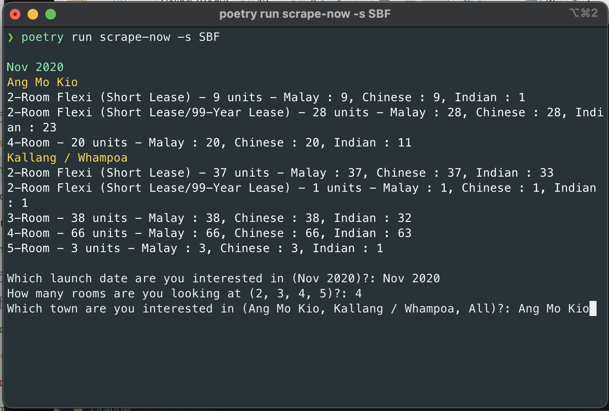

# Simple CLI to scrape for BTO / SBF / OBF flats
This is a simple CLI tool to help you retrieve BTO / SBF / OBF flat details during a launch.


## Installation details
1. Install poetry if you do not have it installed
```bash
curl -sSL https://raw.githubusercontent.com/python-poetry/poetry/master/get-poetry.py | python
```
2. Clone repository
```bash
git clone git@github.com:terencelimzhengwei/bto-sbf-webscraper.git
cd bto-sbf-webscraper
```
3. Install dependencies
```bash
poetry install
```
## Usage
To go through step by step process leverage the -s parameter and provide `SBF` for sales of balance flats, `OBF` for open booking of flats and `BTO` for built to order flats
```bash
# for Build-to-order Flats
poetry run scrape-now -s BTO
# for Sales of Balance Flats
poetry run scrape-now -s SBF
# for Open Booking of Flats
poetry run scrape-now -s OBF
```
This will provide you a list of available flats you can collect data for. You need to provide the `launch date`, `number of rooms` and `town`. The output will be saved as a csv file in the same directory
```bash
Sep 2020
Bishan
5-Room - 1 units - Malay : 1, Chinese : 0, Indian : 0
Clementi
5-Room/3Gen - 4 units - Malay : 4, Chinese : 0, Indian : 4
Queenstown
3-Room - 1 units - Malay : 1, Chinese : 0, Indian : 1

Which launch date are you interested in (Sep 2020)?: Sep 2020
How many rooms are you looking at (3, 5)?: 5
Which town are you interested in (Bishan, Clementi, All)?: Clementi
```
If you know the `Launch Type`, `Launch Date`, `Flat Type`, `Town` you can also directly input it via the CLI using the parameters `-s --selection_type (required)`, `-l --launch_date (required)`, `-f --flat_type`, `-t --town`. If `flat_type` or `town` is not provided, all flat types and towns will be included.
```bash
poetry run scrape-now -s SBF -l Nov 2020 -f 5 -t "Kallang / Whampoa"
```